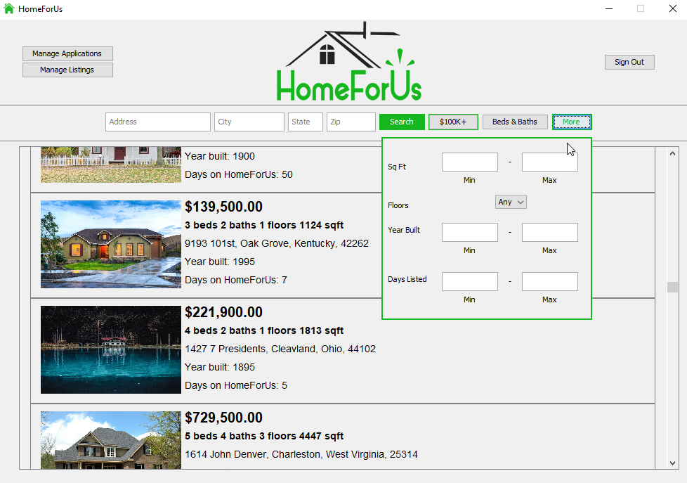

# Homeforus

SER322 HomeForUs  

rdbm.properties located at /src/main/resources  
Update with username and password for database. 

No Gradle installed: 

Windows 
gradlew.bat clean 
gradlew.bat build 
gradlew.bat run 

Linux 
gradlew clean 
gradlew build 
gradlew run 

Gradle Installed: 
gradle clean 
gradle build 
gradle run 

Prepare Database
java Main -DPrepareDatabase=PathtoImages/

=====================================================================

HomeForUs is an application for Realtors and Consumers to streamline the home buying process.

There are two different types of users: Consumers and Realtors. Consumers are focused on buying a house, while Realtors are focused on selling a house. 

A user can log in to HomeForUs and the interface will change, offering them different ways to interact with the system depending on their user account type.

Any user of the system, even if not logged in to an account, can search for homes based on certain attributes such as the location (from the address, city, state, or zip code), cost, number of bedrooms and bathrooms, number of floors, and square footage. Realtors can list homes, as well as edit existing listings, by providing this information in their "Manage Listings" view.

When a Consumer is interested in purchasing a home, they can submit an Application, which is then considered by the Realtor who listed the home. 

Realtors can either Approve or Deny this Application in their "Manage Applications" view, and Consumers can see this decision in their own "Manage Applications" view.

This application is similar in many aspects to many online realtor platforms that we see in today's marketplace. 
